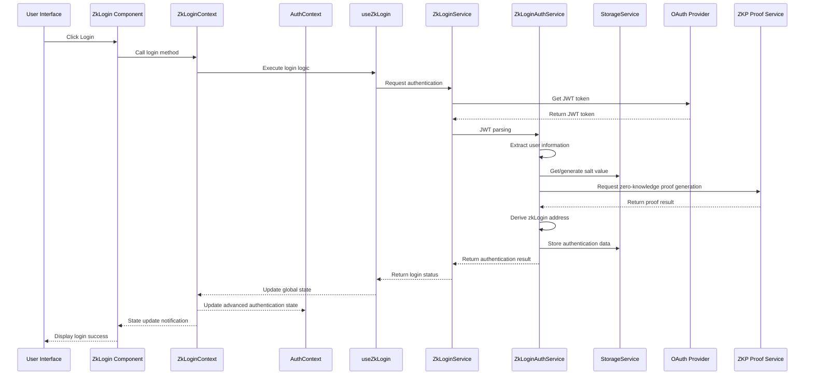
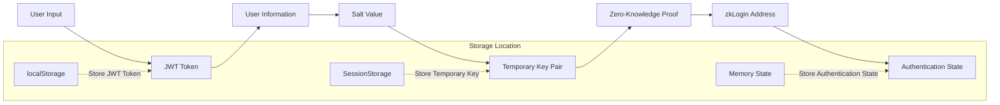
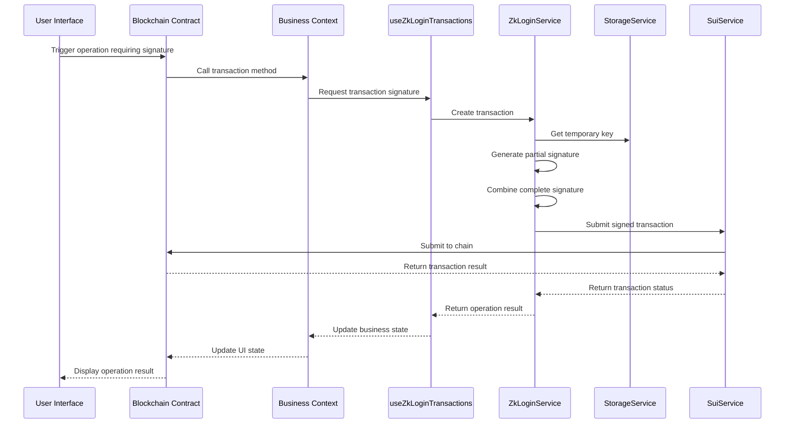
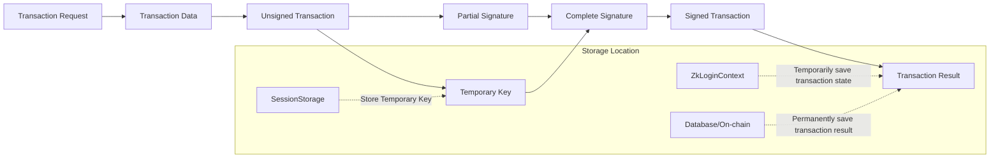
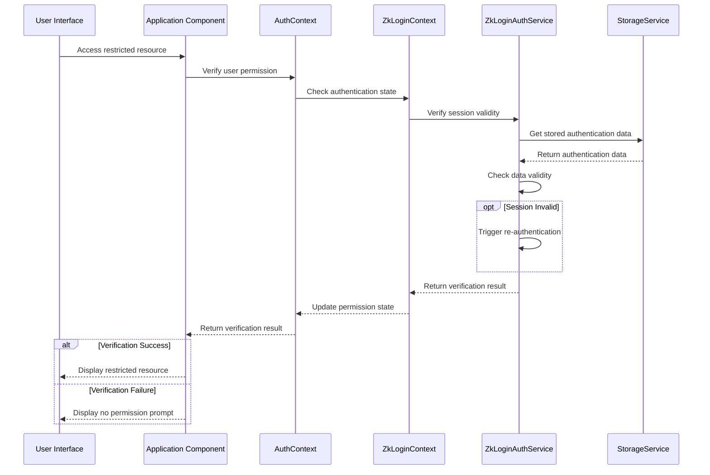
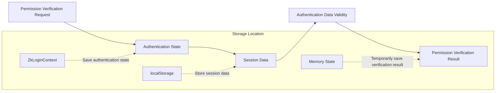

# Authentication System Core Business Logic Analysis

## 1. Login Flow

### Involved Modules
- Frontend Components: `/components/zklogin/`
- Global State: `ZkLoginContext.tsx`, `AuthContext.tsx`
- Business Logic: `useZkLogin.ts`, `useZkLoginParams.ts`
- Service Layer: `ZkLoginService.ts`, `ZkLoginAuthService.ts`
- Data Models: `/interfaces/ZkLogin.ts`
- External Dependencies: OAuth Provider, ZKP Proof Service

### Call Chain Diagram

### Data Flow Diagram

### State Persistence
- JWT Token: Stored in `localStorage`, with expiration time
- User Salt Value: Stored in `localStorage` or database
- Temporary Key: Stored in session storage (`sessionStorage`), automatically cleared when session ends
- Authentication State: Saved in memory via `ZkLoginContext`, restored from storage service after page refresh

## 2. Transaction Signing Flow

### Involved Modules
- Business Components: Subscription/Lottery/Deposit components
- Business Logic: `useZkLoginTransactions.ts`
- Service Layer: `ZkLoginService.ts`, `SuiService.ts`
- Blockchain Contracts: `/contracts/authentication/`

### Call Chain Diagram

### Data Flow Diagram

### State Persistence
- Temporary Key: Temporarily stored in session storage
- Transaction Data: Temporarily stored in memory
- Transaction Result: Saved on the blockchain, may also be cached in the frontend
- Transaction State: Briefly saved in memory via `ZkLoginContext`

## 3. Identity Verification Flow

### Involved Modules
- Application Components: Any component requiring permission verification
- Global State: `AuthContext.tsx`, `ZkLoginContext.tsx`
- Service Layer: `ZkLoginAuthService.ts`, `StorageService.ts`

### Call Chain Diagram

### Data Flow Diagram

### State Persistence
- Authentication State: Saved in memory via `ZkLoginContext`
- Session Data: Stored in `localStorage`, with expiration time
- Permission Information: Briefly saved in memory via `AuthContext`
- Verification Result: Not persisted, verified again when needed
