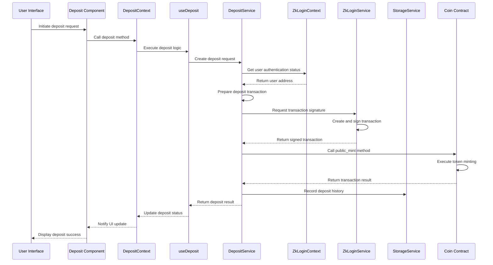
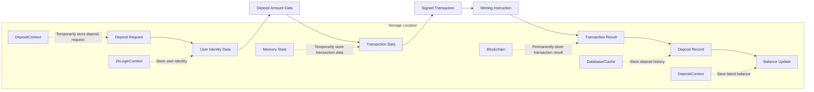
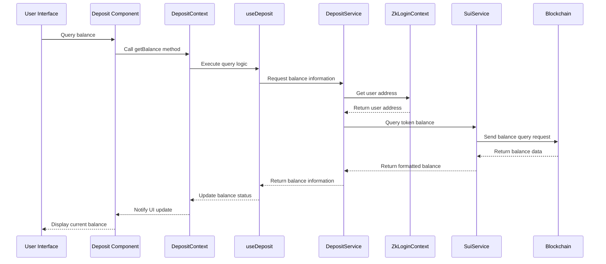
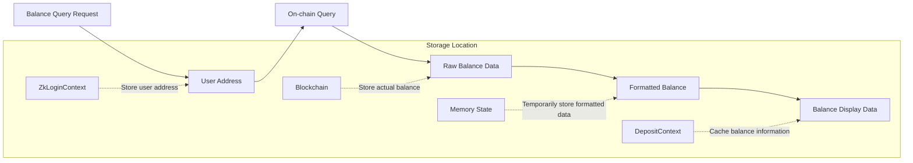
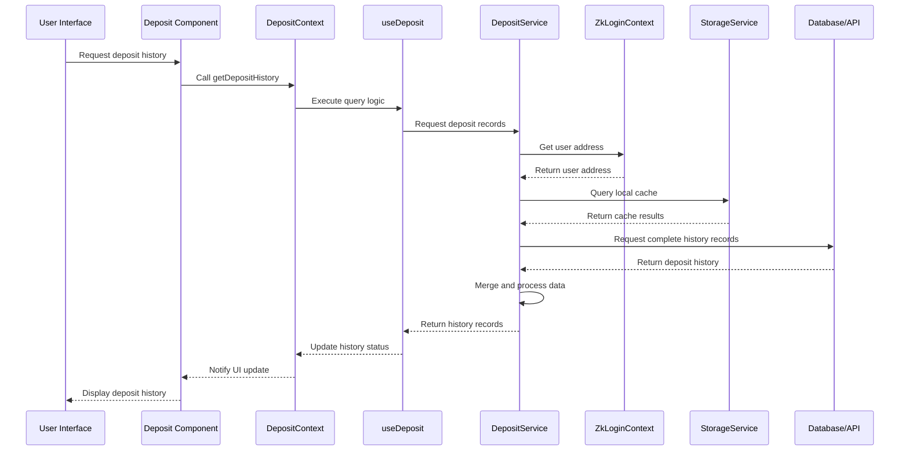
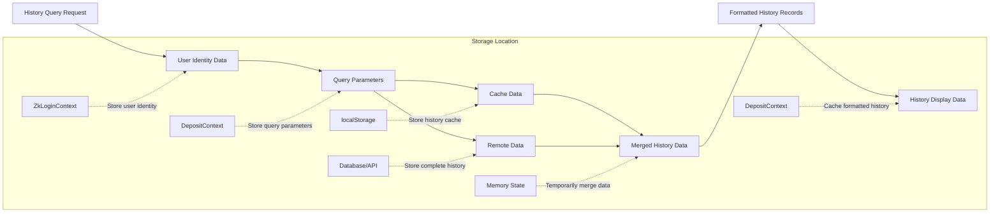
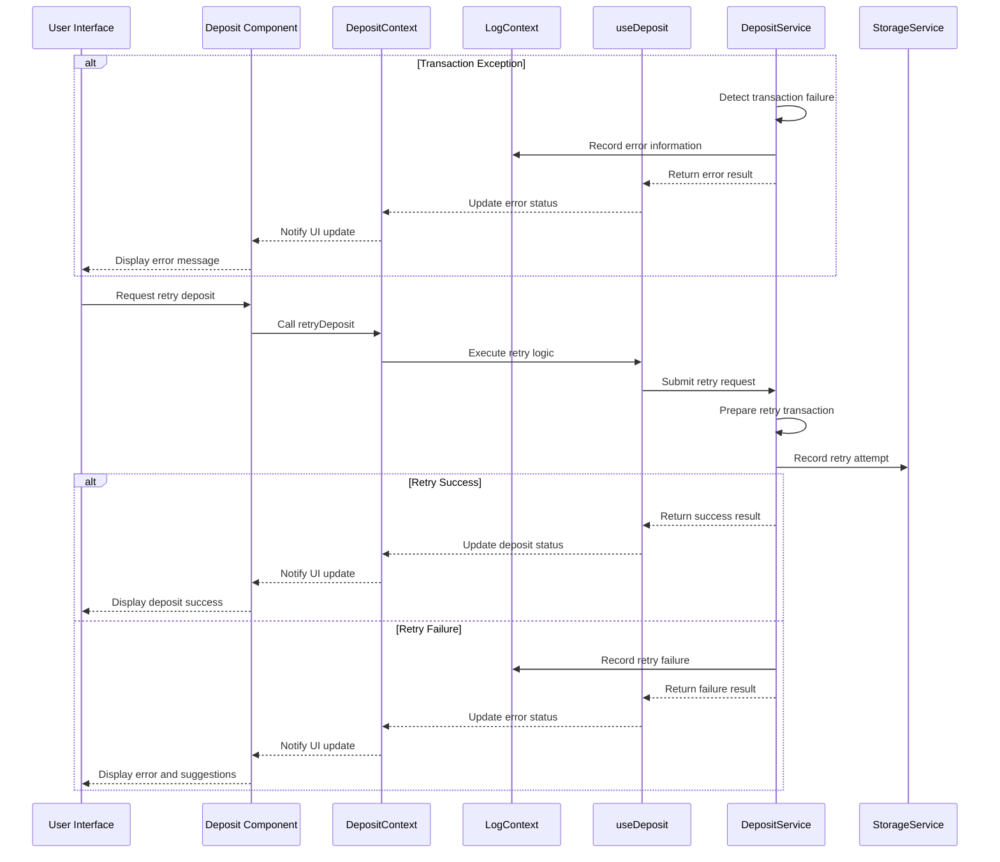
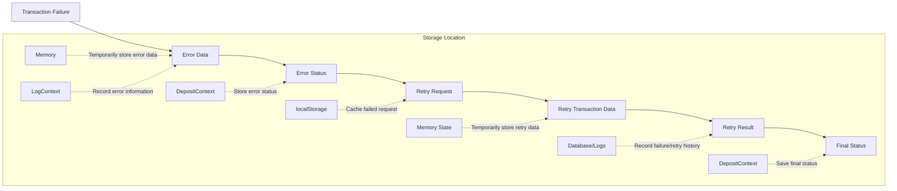

# Deposit System Logic Analysis

## 1. Deposit Process

### Involved Modules
- Frontend Components: `/components/deposit/`
- Global State: `DepositContext.tsx`, `ZkLoginContext.tsx`
- Business Logic: `useDeposit.ts`
- Service Layer: `DepositService.ts`, `ZkLoginService.ts`
- Blockchain Contracts: `/contracts/coin/`
- Data Models: `/interfaces/Deposit.ts`

### Call Chain Diagram

### Data Flow Diagram

### State Persistence
- Deposit request: Temporarily stored in `DepositContext` memory
- User identity data: Stored in `ZkLoginContext` and `localStorage`
- Transaction data: Temporarily stored in memory
- Minting result: Permanently stored on blockchain
- Deposit record: Stored in database and possibly in local cache
- User balance: Stored on blockchain, cached in `DepositContext`

## 2. Balance Query Process

### Involved Modules
- Frontend Components: `/components/deposit/`
- Global State: `DepositContext.tsx`, `ZkLoginContext.tsx`
- Business Logic: `useDeposit.ts`
- Service Layer: `DepositService.ts`, `SuiService.ts`
- Data Models: `/interfaces/Deposit.ts`

### Call Chain Diagram

### Data Flow Diagram

### State Persistence
- User address: Stored in `ZkLoginContext` and `localStorage`
- Actual balance: Permanently stored on blockchain
- Formatted balance: Temporarily stored in memory
- Balance cache: Possibly cached short-term in `DepositContext` and `localStorage`
- Query timestamp: Possibly saved in frontend cache to control query frequency

## 3. Deposit History Query Process

### Involved Modules
- Frontend Components: `/components/deposit/`
- Global State: `DepositContext.tsx`, `ZkLoginContext.tsx`
- Business Logic: `useDeposit.ts`
- Service Layer: `DepositService.ts`, `StorageService.ts`
- Data Models: `/interfaces/Deposit.ts`

### Call Chain Diagram

### Data Flow Diagram

### State Persistence
- Query parameters: Temporarily stored in `DepositContext` memory
- User identity: Stored in `ZkLoginContext` and `localStorage`
- History cache: Possibly stored short-term in `localStorage`
- Complete history: Stored in backend database or retrieved from on-chain transaction records
- Merged data: Temporarily stored in memory
- Display data: Cached in `DepositContext`, possibly saved in `sessionStorage`

## 4. Deposit Failure Handling Process

### Involved Modules
- Frontend Components: `/components/deposit/`
- Global State: `DepositContext.tsx`, `LogContext.tsx`
- Business Logic: `useDeposit.ts`
- Service Layer: `DepositService.ts`

### Call Chain Diagram

### Data Flow Diagram

### State Persistence
- Error data: Recorded in logging system and memory
- Error status: Stored in `DepositContext`
- Failed request: Possibly cached in `localStorage` for retry
- Retry history: Possibly recorded in database or logging system
- Final status: Updated to `DepositContext`, possibly saved in local storage
