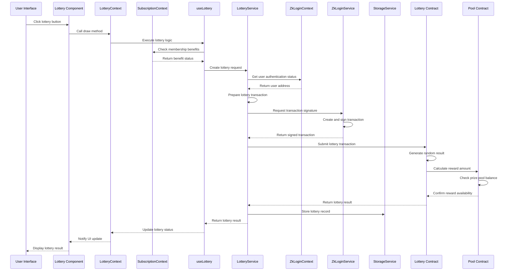
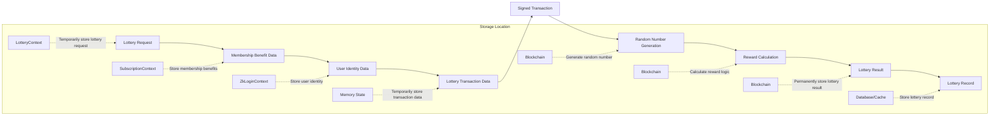
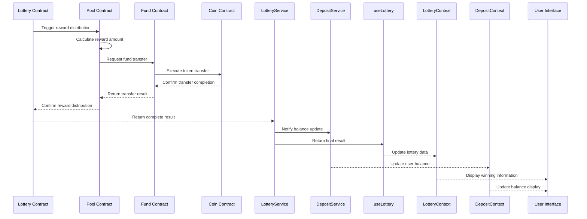
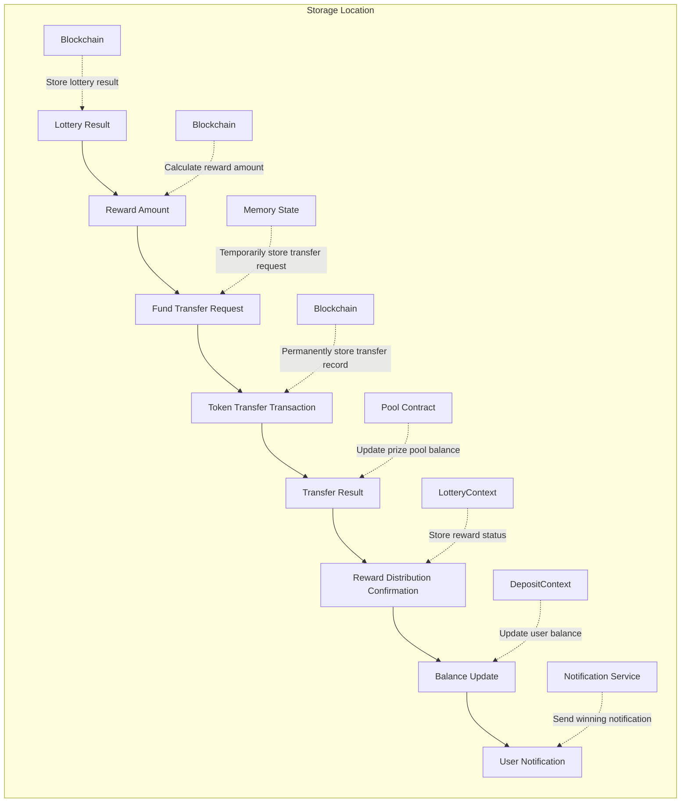
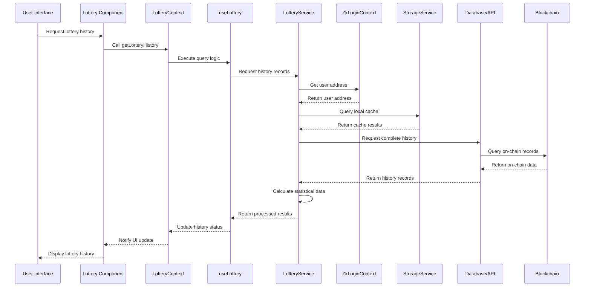
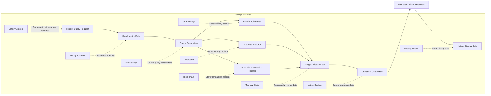
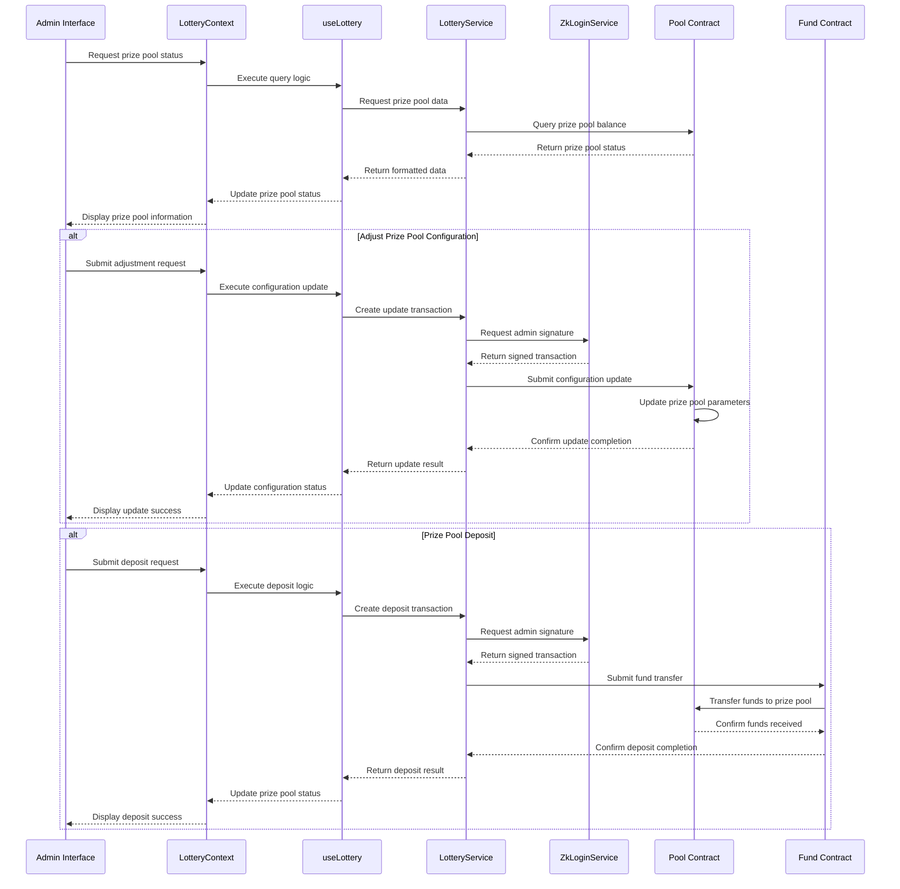
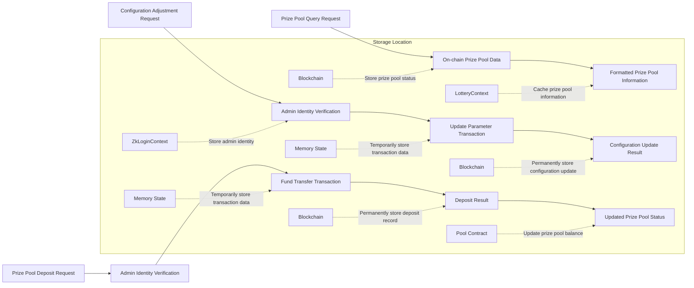

# Lottery System Logic Analysis

## 1. Lottery Process

### Involved Modules
- Frontend Components: `/components/lottery/`
- Global State: `LotteryContext.tsx`, `ZkLoginContext.tsx`, `SubscriptionContext.tsx`
- Business Logic: `useLottery.ts`
- Service Layer: `LotteryService.ts`, `ZkLoginService.ts`
- Blockchain Contracts: `/contracts/lottery/`, `/contracts/pool/`
- Data Models: `/interfaces/Lottery.ts`

### Call Chain Diagram

### Data Flow Diagram

### State Persistence
- Lottery request: Temporarily stored in `LotteryContext` memory
- Membership benefits: Stored in `SubscriptionContext` and on blockchain
- User identity: Stored in `ZkLoginContext` and `localStorage`
- Lottery transaction: Temporarily stored in memory, eventually stored on blockchain
- Lottery result: Permanently stored on blockchain
- Lottery record: Stored in database and possibly in local cache

## 2. Reward Distribution Process

### Involved Modules
- Global State: `LotteryContext.tsx`, `DepositContext.tsx`
- Business Logic: `useLottery.ts`
- Service Layer: `LotteryService.ts`, `DepositService.ts`
- Blockchain Contracts: `/contracts/pool/`, `/contracts/fund/`, `/contracts/coin/`

### Call Chain Diagram

### Data Flow Diagram

### State Persistence
- Lottery result: Permanently stored on blockchain
- Reward amount: Calculated and stored in transactions on blockchain
- Transfer record: Permanently stored on blockchain
- Prize pool balance: Stored in Pool contract on blockchain
- User balance: Stored on blockchain, cached in `DepositContext`
- Reward status: Stored in `LotteryContext`, possibly saved to local storage

## 3. History Query Process

### Involved Modules
- Frontend Components: `/components/lottery/`
- Global State: `LotteryContext.tsx`, `ZkLoginContext.tsx`
- Business Logic: `useLottery.ts`
- Service Layer: `LotteryService.ts`, `StorageService.ts`
- Data Models: `/interfaces/Lottery.ts`

### Call Chain Diagram

### Data Flow Diagram

### State Persistence
- Query parameters: Temporarily stored in `LotteryContext` memory
- User identity: Stored in `ZkLoginContext` and `localStorage`
- History cache: Possibly stored short-term in `localStorage`
- Complete history: Stored in database and on blockchain
- Statistical data: Temporarily calculated, possibly cached in `LotteryContext`
- Display data: Cached in `LotteryContext`, possibly stored short-term in `sessionStorage`

## 4. Prize Pool Management Process

### Involved Modules
- Global State: `LotteryContext.tsx`
- Business Logic: `useLottery.ts` (possible management function)
- Service Layer: `LotteryService.ts`
- Blockchain Contracts: `/contracts/pool/`, `/contracts/fund/`

### Call Chain Diagram

### Data Flow Diagram

### State Persistence
- Prize pool status: Permanently stored in Pool contract on blockchain
- Prize pool information: Temporarily cached in `LotteryContext`
- Admin identity: Stored in `ZkLoginContext` and `localStorage`
- Configuration parameters: Permanently stored in Pool contract on blockchain
- Deposit record: Permanently stored on blockchain
- Management logs: Possibly saved in database or dedicated logging system
