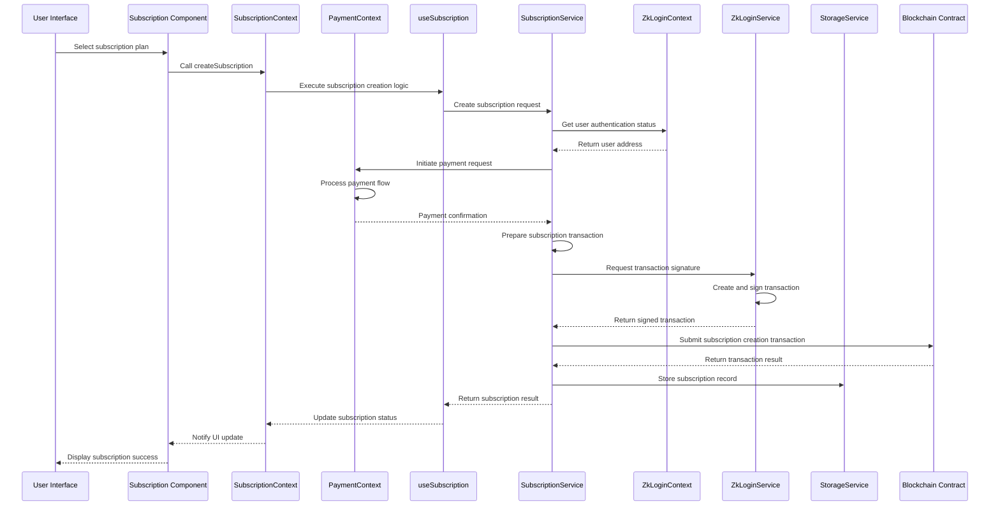
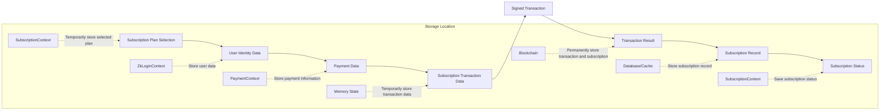
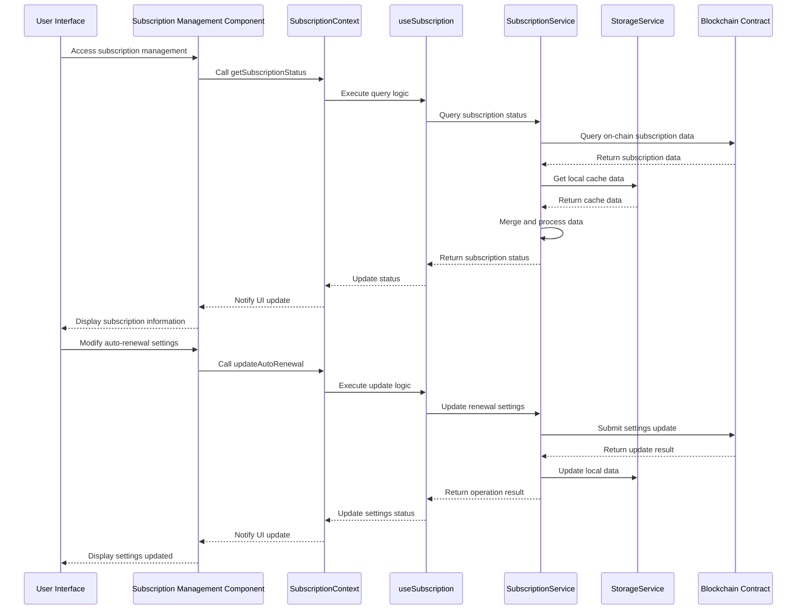
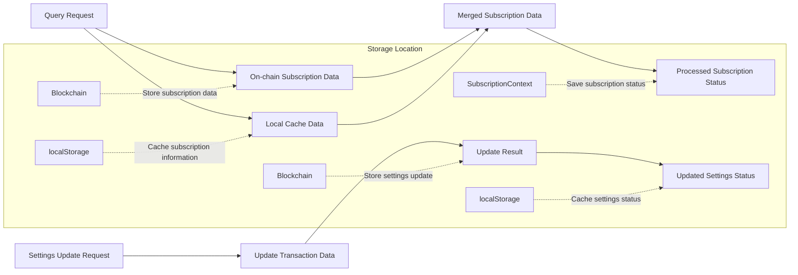
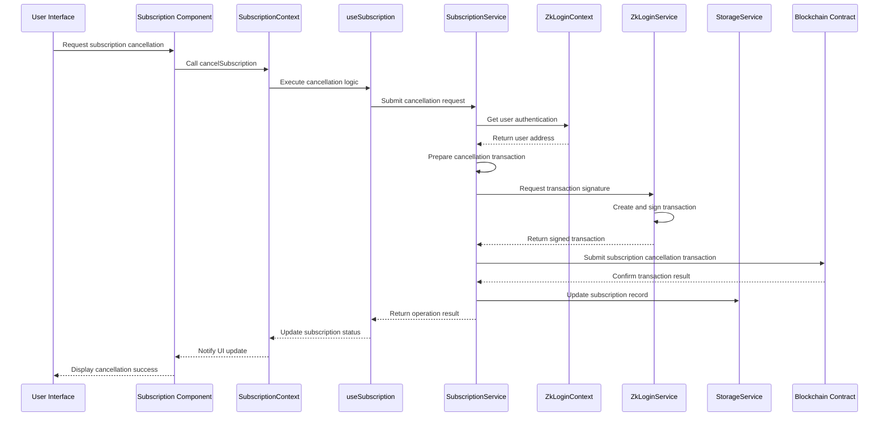
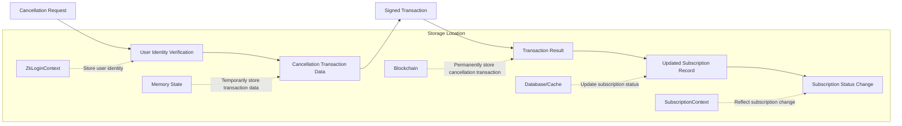
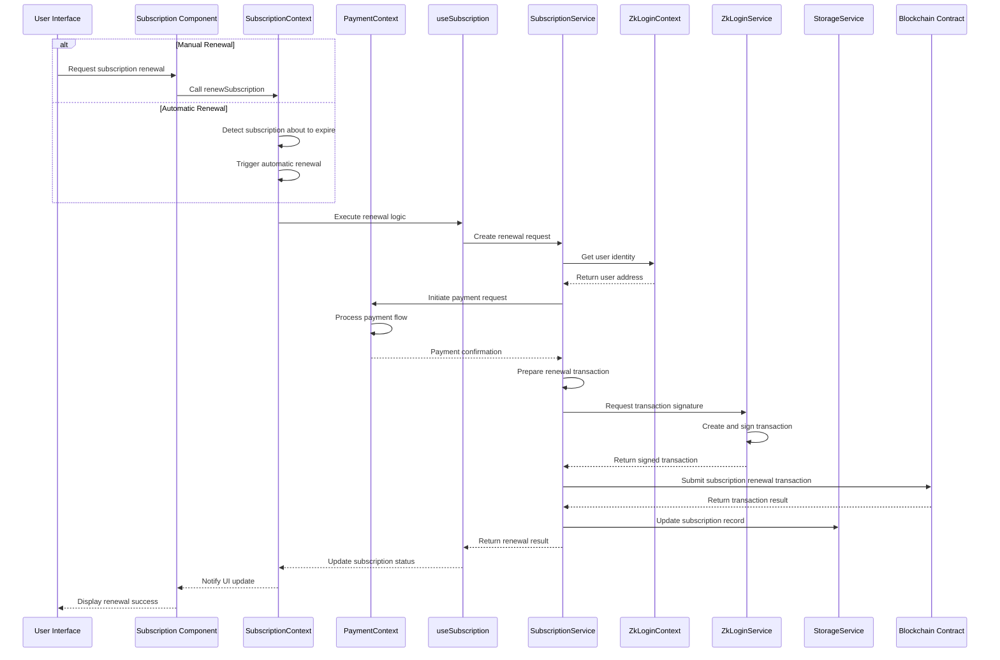
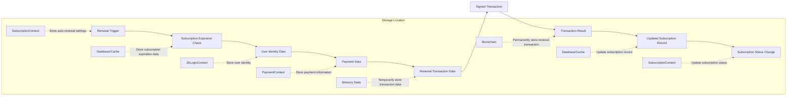

# Subscription System Core Business Logic Analysis

## 1. Subscription Creation Process

### Involved Modules
- Frontend Components: `/components/subscription/`
- Global State: `SubscriptionContext.tsx`, `ZkLoginContext.tsx`, `PaymentContext.tsx`
- Business Logic: `useSubscription.ts`
- Service Layer: `SubscriptionService.ts`, `ZkLoginService.ts`
- Blockchain Contracts: `/contracts/subscription/`, `/contracts/authentication/`
- Data Models: `/interfaces/Subscription.ts`

### Call Chain Diagram

### Data Flow Diagram

### State Persistence
- Subscription plan data: Temporarily stored in `SubscriptionContext` memory
- User identity information: Stored in `ZkLoginContext` and `localStorage`
- Payment data: Temporarily stored in `PaymentContext` memory
- Transaction data: Permanently stored on blockchain
- Subscription records: Saved in database and on blockchain
- Subscription status: Persisted to `localStorage` through `SubscriptionContext`

## 2. Subscription Management Process

### Involved Modules
- Frontend Components: `/components/subscription/`
- Global State: `SubscriptionContext.tsx`
- Business Logic: `useSubscription.ts`
- Service Layer: `SubscriptionService.ts`
- Data Models: `/interfaces/Subscription.ts`

### Call Chain Diagram

### Data Flow Diagram

### State Persistence
- Subscription status data: Stored both on blockchain and in local cache
- Local cache: Uses `localStorage` and `SubscriptionContext` for storage
- Settings preferences: Stored on blockchain, with local cache copy
- Operation results: Temporarily stored in memory, possibly recorded in logs

## 3. Subscription Cancellation Process

### Involved Modules
- Frontend Components: `/components/subscription/`
- Global State: `SubscriptionContext.tsx`, `ZkLoginContext.tsx`
- Business Logic: `useSubscription.ts`
- Service Layer: `SubscriptionService.ts`, `ZkLoginService.ts`
- Blockchain Contracts: `/contracts/subscription/`

### Call Chain Diagram

### Data Flow Diagram

### State Persistence
- Cancellation request: Temporarily saved in memory
- Authentication data: Stored in `ZkLoginContext` and `localStorage`
- Transaction result: Permanently saved on blockchain
- Subscription status: Updated in database and `localStorage`
- Status change: Saved through `SubscriptionContext` and notified to UI

## 4. Subscription Renewal Process

### Involved Modules
- Frontend Components: `/components/subscription/`
- Global State: `SubscriptionContext.tsx`, `PaymentContext.tsx`, `ZkLoginContext.tsx`
- Business Logic: `useSubscription.ts`
- Service Layer: `SubscriptionService.ts`, `PaymentService.ts`, `ZkLoginService.ts`
- Blockchain Contracts: `/contracts/subscription/`, `/contracts/fund/`

### Call Chain Diagram

### Data Flow Diagram

### State Persistence
- Auto-renewal settings: Saved on blockchain and in local storage
- Subscription expiration data: Tracked in database and local cache
- Payment information: Temporarily saved in `PaymentContext` memory
- Transaction result: Permanently saved on blockchain
- Subscription status: Updated in database, local storage, and `SubscriptionContext`
- Operation records: Possibly recorded in logs and on blockchain
